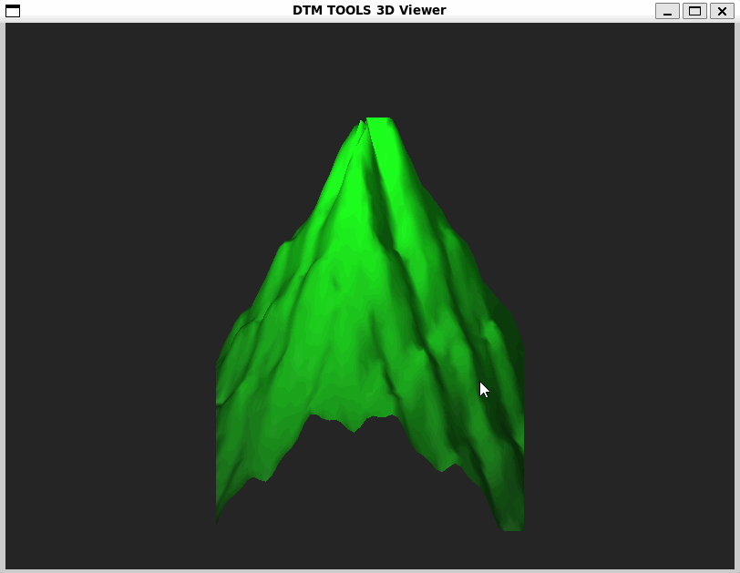

# dtm-tools



The dtm-tools utility is a lightweight command-line application written in C. It is designed to import 3D point clouds from CSV files, reconstruct a Digital Terrain Model (DTM) using Delaunay Triangulation, and visualize the generated surface in an interactive 3D viewport.

## Key Features
* **Performance:** Implemented in raw C without redundant third-party runtime dependencies.
* **Triangulation:** Features an incremental Bowyer-Watson algorithm to construct a Triangulated Irregular Network (TIN) from distributed geographical points with O(N²) computational complexity.
* **Unit Testing:** Mathematical predicates, geometric calculations, and collinear edge cases are verified using the GoogleTest (gtest) framework.
* **Automatic Bounds Interpretation:** Automatically computes terrain bounding boxes and scales coordinates to center the 3D model regardless of the original GIS coordinate offset.
* **Hypsometric Tinting:** Vertices are dynamically shaded based on their absolute elevation (Z-coordinate), producing a smooth topographic color gradient.
* **Interactive Viewport:** Real-time viewport control using keyboard arrows to rotate and inspect the terrain model.

## System Requirements and Dependencies
The utility is developed for Linux-based environments (including WSL2 under Windows). To build, test, and run the project, the following dependencies are required:
* A C/C++ compiler supporting C99 and C++14 standards (gcc / g++)
* CMake build system (version 3.14 or higher)
* Graphics libraries: GLFW3 and OpenGL

To install the necessary development packages on Ubuntu/Debian/WSL, execute:
```bash
sudo apt update && sudo apt install -y build-essential cmake libglfw3-dev libgl1-mesa-dev libglu1-mesa-dev
```

## Building the Project
Project compilation is automated via CMake. On the first configuration run, the GoogleTest framework is downloaded and isolated using FetchContent.

```bash
# 1. Create a dedicated build directory and enter it
mkdir build && cd build

# 2. Generate configuration files and build the target binary
cmake ..
make
```

## Running Unit Tests
The core geometric logic is isolated and verified. To execute the automated test suites, run the following command inside the build directory:

```bash
./run_tests
```
The test coverage focuses on:
1. `get_circumcircle`: Validating coordinates and radius calculations for a triangle's circumcircle.
2. `CollinearPoints`: Ensuring safety against degenerate cases when 3 points lie on a straight line.
3. `is_point_in_circumcircle`: Verifying Delaunay criteria adherence when an incremental point falls inside or outside a circumcircle.

## Usage and Execution
Run the main application by passing the path to the target terrain CSV file as a command-line argument:

```bash
./dtm_viewer ../data/real_mountain.csv
```

### Input CSV Format Specification
The input file must contain a header row (X,Y,Z), and point coordinates must be strictly comma-separated. Example:
```text
X,Y,Z
0.0,0.0,5300.0
125.0,250.0,6124.6
250.0,250.0,8611.0
```

## Controls in the 3D Viewport
* **Left / Right Arrows:** Rotate the terrain around the vertical Z-axis (yaw).
* **Up / Down Arrows:** Tilt the camera angle up and down (pitch).
* **ESC Key:** Close the window and terminate execution with safe heap memory deallocation.
